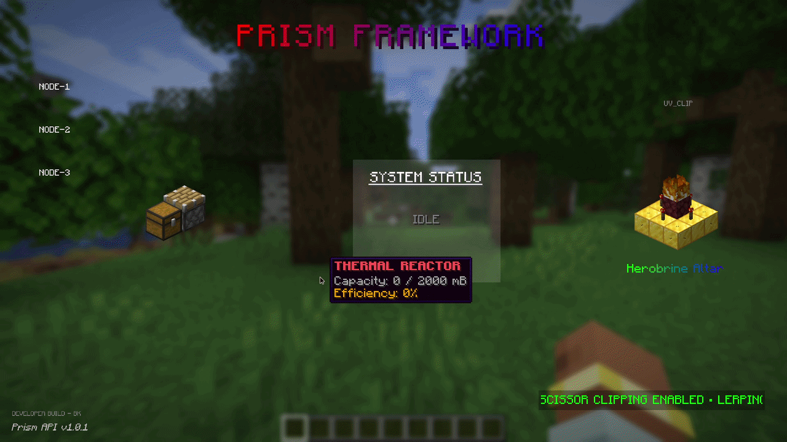

***

## ⚠️ WORK IN PROGRESS
This branch contains experimental 3D rendering features for `v1.1.0`.
For stable builds, use the [master branch](https://github.com/Bartus131313/PrismAPI/tree/master).

However if you would like to test this version in *Early Access* you can do it by changing the version in `build.gradle` and following the **Installation Guide** below.
```groovy
def prism_version = "dev~1.1.0-SNAPSHOT"
```

***

# 💎 Prism API

### **The Ultimate Rendering Framework for Minecraft NeoForge/Fabric.**
Prism is a high-performance, developer-friendly UI and rendering library designed to bridge the gap between "standard modded UIs" and "professional dashboard experiences." It provides a suite of tools for handling complex layouts, fluid dynamics, and butter-smooth animations with minimal boilerplate.

## ✨ Features
- ⚡ **Hybrid Rendering**: Combines ~~immediate-mode convenience with retained-mode efficiency.
- 🌊 **Advanced Fluid Tanks**: Built-in support for animated fluid rendering with custom~~ tiling, UV clipping, and dynamic tooltips.
- 📈 **Smooth Motion Engine**: A full suite of 30+ easing functions (Sine, Elastic, Bounce, etc.) with Delta-Time independent smoothing.
- 🌈 **Gradient Typography**: Per-character color interpolation supporting Component color multiplication (tinting).
- 📐 **Adaptive Layouts**: Flex-box inspired PrismLayout system for automatic horizontal and vertical element positioning.
- ✂️ **Precision Clipping**: Easy-to-use Scissor API for marquees, scrolling lists, and contained UI elements.

## 📒 Version History
| Version  | Name         | Primary Focus                                        | Full Details                    | 
|----------|--------------|------------------------------------------------------|---------------------------------|
| `v1.0.0` | Foundational | Core 2D UI components, fluids, and layouts.          | [View Log](docs/changelogs/1.0.0.MD) |
| `v1.1.0` | Architect    | 3D-on-2D Pipeline, Piston logic, and NBT structures. | [View Log](docs/changelogs/1.1.0.MD) |

## 🔨 Demo of the example usage (`The Architect`)


## 🚀 Quick Start
1. **Smooth Rendering**
> Instead of static bars, use the PrismAnimation utility to create organic movement
```java
// Inside your render loop
float deltaTime = (System.currentTimeMillis() - lastTime) / 1000f;
this.displayValue = PrismAnimation.lerp(displayValue, targetValue, deltaTime * 5.0f);

// Render with a "Bounce" effect
float easedValue = PrismAnimation.easeOutBounce(displayValue);
PrismRenderer.renderProgressBar(gui, x, y, w, h, easedValue, Color.CYAN, PrismDirection.RIGHT);
```

2. **Gradient Text**
> Render beautiful, multi-colored titles that respect Minecraft's Component styles
```java
PrismRenderer.renderStringGradientCenteredX(
    guiGraphics, 
    font, 
    Component.literal("Prism API").withStyle(ChatFormatting.BOLD),
    width / 2, 20, 2.0f,    // X, Y, Scale
    new Color(0, 255, 255), // StartColor: Aqua
    new Color(170, 0, 255), // EndColor: Purple
    true                    // Shadow?
);
```

3. **Smart Layouts**
> Stop hardcoding X and Y coordinates. Let PrismLayout handle the math
```java
PrismLayout layout = new PrismLayout();
layout.setSpacing(10);

layout.addElement(32, 100, (info) -> {
    PrismRenderer.renderFluidTank(info.guiGraphics(), Fluids.LAVA, 1000, 1000, info.x(), info.y(), info.width(), info.height());
});

// Draws all elements horizontally centered
layout.drawHorizontal(guiGraphics, centerX, centerY, mouseX, mouseY);
```

## 🛠️ API Reference
### Typography (`PrismRenderer`)

| Method                   | Description                                          |
|--------------------------|------------------------------------------------------|
| `renderString`           | Standard scaled rendering (Subject-First signature). | 
| `renderStringGradient`   | character-by-character color blending.               |
| `renderStringCenteredXY` | Perfect alignment on both axes.                      |

### Visuals (`PrismRenderer`)

| Method                       | Description                                   |
|------------------------------|-----------------------------------------------|
| `renderFluidTank`            | Tiles fluid textures vertically/horizontally. |
| `renderProgressBar`          | Supports 4 directions and color gradients.    |
| `renderProgressBarTexture`   | Standard UV-clipping for custom GUI textures. |
| `startScissor / stopScissor` | GPU-level area clipping.                      |

### Animation (`PrismAnimation`)
#### Includes easeIn, easeOut, and easeInOut variants for:
* Linear / Sine / Quad / Cubic
* Elastic / Bounce / Back (For physical UI feedback)
* SmoothStep (For natural transitions)

## 📦 Installation
Add the following to your build.gradle:
```groovy
def prism_version = "main-SNAPSHOT" // Replace with the version you want (e.g., v1.0.0 or main-SNAPSHOT)

repositories {
    maven { url "https://jitpack.io" }
}

dependencies {
    // --- For NeoForge Projects ---
    modImplementation "com.github.Bartus131313.PrismAPI:prism-api-neoforge:${prism_version}"

    // --- For Fabric Projects ---
    modImplementation "com.github.Bartus131313.PrismAPI:prism-api-fabric:${prism_version}"
}
```

## 📜 License
This project is licensed under the **MIT License**.
You are free to use this API in any mod or modpack, provided that the original copyright notice and this permission notice are included in all copies or substantial portions of the software.

*Prism isn't just an API; it's a new perspective on Minecraft UI.*